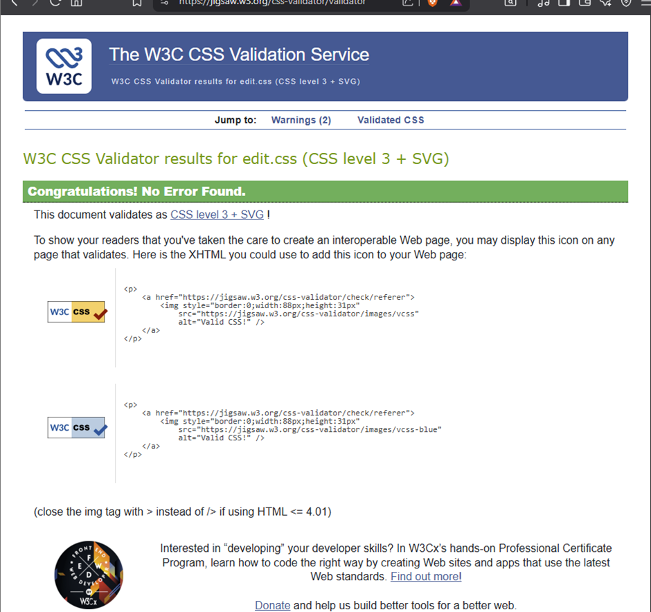
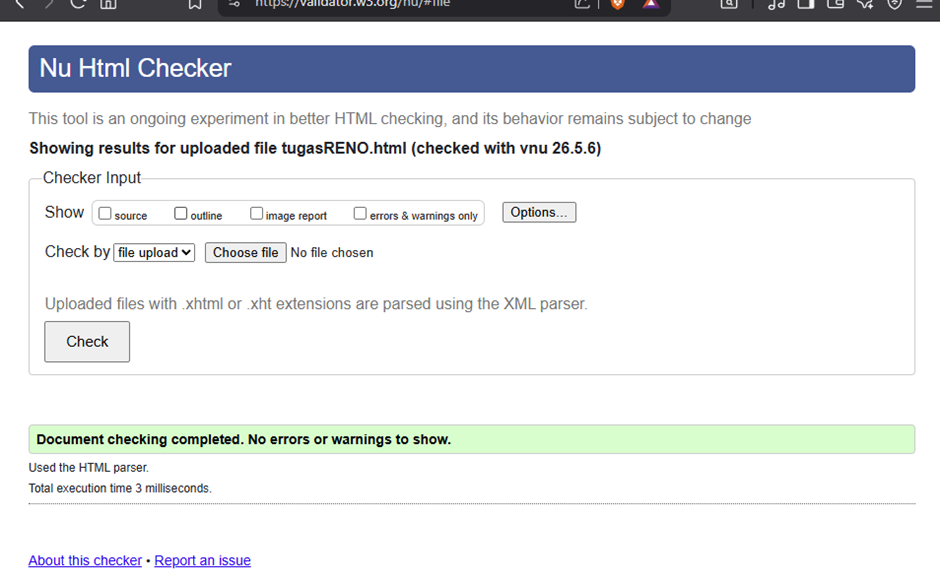

# Laporan Tugas Website Portofolio

## Deskripsi Proyek

Website ini adalah portofolio pribadi saya yang berisi informasi tentang diri saya, jurusan, hobi, dan kontak WhatsApp. Dibuat menggunakan HTML5 dan CSS3.

## Struktur Folder dan File

- `index.html` (atau tugasRENO.html): Struktur utama website.
- `edit.css`: File pengatur tampilan (styling).
- `Renomaingitar.jpeg`: Foto hobi.
- `background.jpg`: Gambar latar belakang.

## Link Website

Link website saya: [https://renotheo.github.io/Tugas-HTML-dan-CSS/tugasRENO.html]

## Bukti Konfigurasi SSH ## Hasil Validasi W3C

Website sudah divalidasi dan bebas dari error HTML/CSS.

